# Informe – Laboratorio 4: REST API Blueprints
**Escuela Colombiana de Ingeniería – Arquitecturas de Software**  
**Estudiantes:** Nicolás Parrado – Juan Hernández  
**Fecha:** 2026-08-23  

---

## 1. De qué trata

Construimos una API REST para manejar blueprints (planos) usando Java 21 y Spring Boot 3.3.x. La idea fue aplicar buenas prácticas de diseño REST, conectar una base de datos PostgreSQL real, documentar todo con Swagger y agregar filtros de procesamiento de puntos.

---

## 2. Cómo está organizado el proyecto

```
src/main/java/edu/eci/arsw/blueprints
  ├── model/         → Blueprint, Point
  ├── persistence/   → Interfaz BlueprintPersistence + InMemoryBlueprintPersistence
  │    └── impl/     → PostgresBlueprintPersistence, BlueprintEntity, BlueprintJpaRepository
  ├── services/      → BlueprintsServices
  ├── filters/       → IdentityFilter, RedundancyFilter, UndersamplingFilter
  ├── controllers/   → BlueprintsAPIController, ApiResponse<T>
  └── config/        → OpenApiConfig
```

Cada capa tiene su responsabilidad clara: el controlador recibe peticiones, el servicio orquesta la lógica, y la persistencia guarda los datos. Cambiar de base de datos no requiere tocar nada más allá de la capa de persistencia.

---

## 3. Qué se implementó

### 3.1 Respuesta uniforme con ApiResponse\<T\>

Todas las respuestas de la API tienen el mismo formato gracias al record `ApiResponse<T>`:

```java
public record ApiResponse<T>(int code, String message, T data) {}
```

Ejemplo de respuesta:
```json
{
  "code": 200,
  "message": "execute ok",
  "data": { "author": "john", "name": "house", "points": [...] }
}
```

### 3.2 Buenas prácticas REST

- El path base es `/api/v1/blueprints`, lo que permite versionar la API sin romper clientes existentes.
- Los códigos HTTP usados son:
  - `200 OK` → consultas exitosas
  - `201 Created` → blueprint creado
  - `202 Accepted` → punto agregado
  - `404 Not Found` → recurso no existe
  - `409 Conflict` → blueprint duplicado

### 3.3 Persistencia en PostgreSQL

Se creó `PostgresBlueprintPersistence` con Spring Data JPA. Se activa con el perfil `postgres` y la base de datos corre en Docker:

```bash
docker compose up -d
mvn spring-boot:run "-Dspring-boot.run.profiles=postgres"
```

Hibernate crea las tablas automáticamente:
- `blueprints` → autor y nombre
- `blueprint_points` → puntos de cada blueprint

### 3.4 Filtros de puntos

| Filtro | Perfil | Qué hace |
|--------|--------|----------|
| `IdentityFilter` | (default) | No modifica nada |
| `RedundancyFilter` | `redundancy` | Elimina puntos consecutivos repetidos |
| `UndersamplingFilter` | `undersampling` | Se queda con 1 de cada 2 puntos |

Para activar un filtro se combina con el perfil de base de datos:
```bash
mvn spring-boot:run "-Dspring-boot.run.profiles=postgres,redundancy"
```

### 3.5 Documentación con Swagger

La documentación se genera automáticamente desde las anotaciones del código:
- Swagger UI: http://localhost:8080/swagger-ui/index.html
- OpenAPI JSON: http://localhost:8080/v3/api-docs

---

## 4. Evidencias

### 4.1 Aplicación iniciada

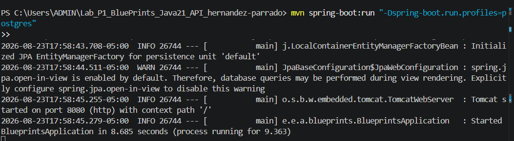

### 4.2 Swagger UI – endpoints disponibles

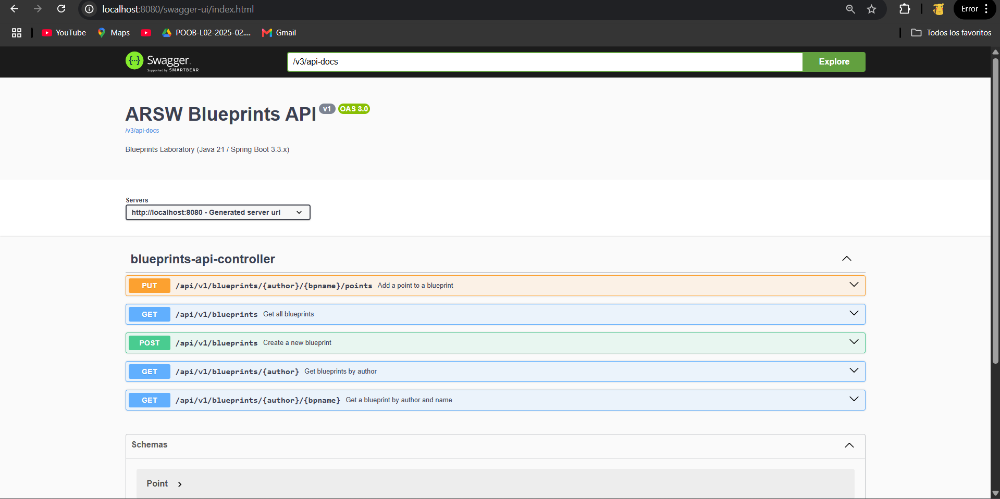

### 4.3 GET /api/v1/blueprints – todos los blueprints

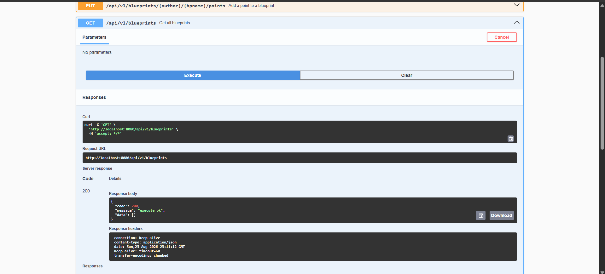

### 4.4 GET /api/v1/blueprints/john – por autor

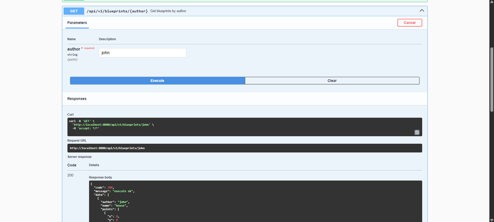

### 4.5 GET /api/v1/blueprints/john/house – uno específico

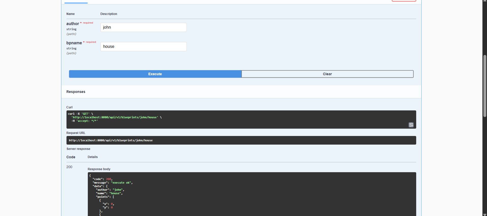

### 4.6 POST /api/v1/blueprints – crear blueprint

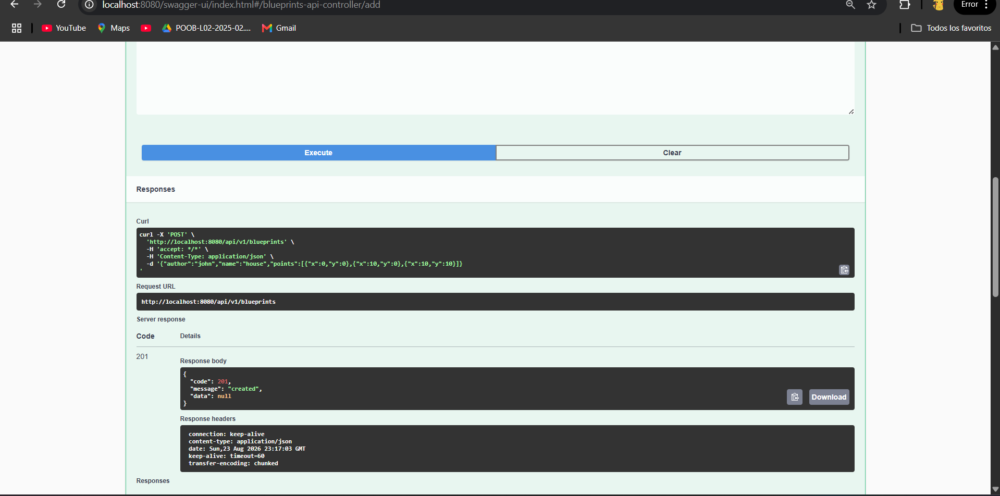

### 4.7 PUT /api/v1/blueprints/{author}/{name}/points – agregar punto

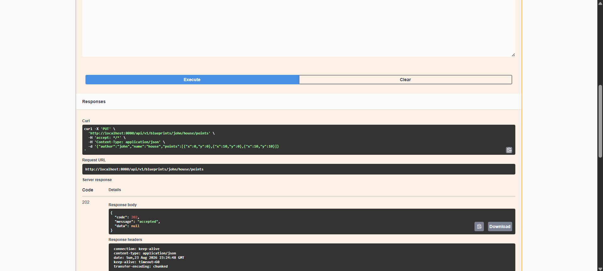

### 4.8 Datos en PostgreSQL

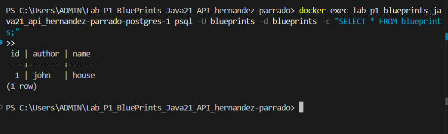

### 4.9 Tests pasando

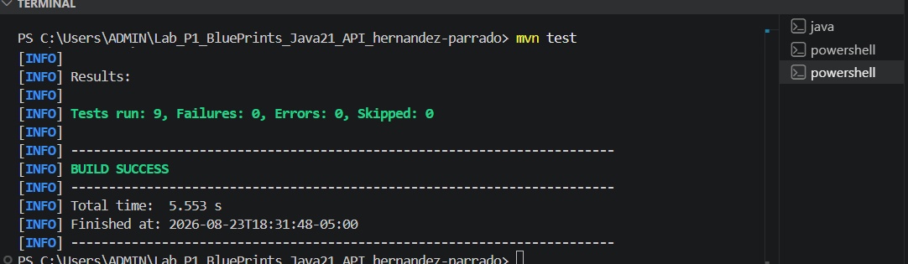

---

## 5. Buenas prácticas aplicadas

1. **Versionamiento**: `/api/v1/` en el path permite evolucionar la API sin romper lo que ya existe.
2. **Respuesta uniforme**: `ApiResponse<T>` hace que todos los endpoints respondan igual, fácil de consumir.
3. **Perfiles de Spring**: `@Profile("postgres")` y `@Profile("!postgres")` permiten cambiar la persistencia sin tocar código.
4. **Constructor injection**: ningún componente usa `@Autowired` en campos, lo que facilita los tests.
5. **Inmutabilidad**: `Point` es un record de Java 21, no se puede modificar accidentalmente.
6. **Documentación viva**: Swagger se genera desde el código, siempre está actualizado.

---

## 6. Cómo correrlo

```bash
# Solo en memoria
mvn spring-boot:run

# Con PostgreSQL
docker compose up -d
mvn spring-boot:run "-Dspring-boot.run.profiles=postgres"

# Tests
mvn test
```

---

## 7. Bono: imagen Docker

Se construyó una imagen del proyecto usando el Dockerfile incluido:

```bash
docker build -t blueprints-api:1.0.0 .
```

### 7.1 Build de la imagen

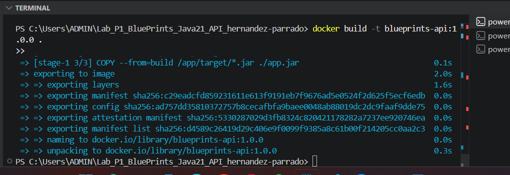

### 7.2 Imagen en Docker

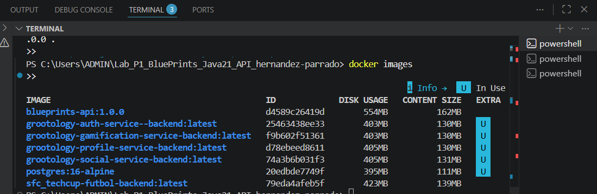

---

## 8. Conclusiones

- Separar en capas hace que agregar una nueva base de datos o un nuevo filtro no afecte el resto del sistema.
- Los perfiles de Spring son una forma limpia de manejar configuraciones por ambiente sin duplicar código.
- `ApiResponse<T>` como record de Java 21 es conciso, inmutable y type-safe.
- Spring Data JPA elimina casi todo el código repetitivo de persistencia.
